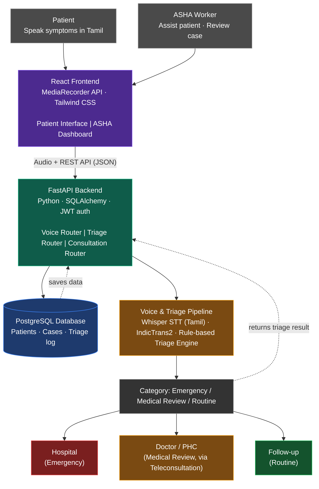
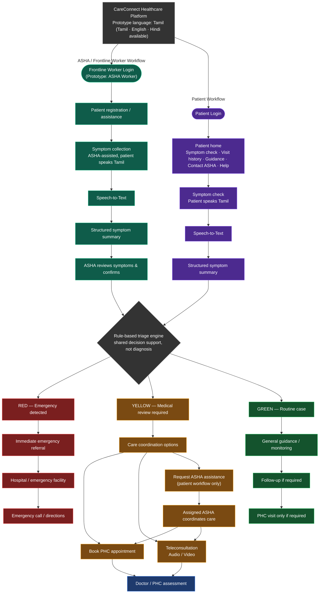

# CareConnect

**Speak. Triage. Connect.**

CareConnect is a proposed voice-first, offline-first rural healthcare platform. It is designed to help rural patients and ASHA workers reach the appropriate level of care through regional-language voice interaction, symptom analysis, preliminary triage, and healthcare connectivity.

A patient speaks in their regional language, the system assesses the urgency of the case, and routes them toward the right care pathway.

---

## Problem

Rural communities face several recurring barriers to timely healthcare:

- Limited access to doctors and specialists
- Long distances to healthcare facilities
- Poor or unreliable internet connectivity
- Regional-language and communication barriers
- Low digital literacy
- Difficulty identifying when symptoms require urgent attention
- Limited digital tools for ASHA workers

Most existing digital healthcare platforms depend heavily on typing, reading, and stable internet connectivity — assumptions that do not hold in many rural settings. CareConnect is built around a voice-first, offline-first approach instead.

---

## Proposed Solution

CareConnect allows a patient to speak naturally in a supported regional language instead of typing their symptoms. The system processes the spoken input, analyzes the symptoms, determines the urgency of the case, and connects the patient to the appropriate healthcare pathway.

CareConnect is not intended to diagnose disease. Its purpose is to determine how urgent a situation is and what the patient should do next.

---

## System Architecture

---

## Patient and ASHA Worker Journey


---

## Voice-First Interaction

Voice is the primary input method in CareConnect. A patient can speak naturally in a supported regional language without needing to type a description of their symptoms.

Processing path: regional-language speech → Whisper → regional-language text → IndicTrans2 → English (or another common processing language) → symptom analysis.

The original regional-language input is retained for transparency and for ASHA or healthcare-worker review.

---

## Regional Language Support

CareConnect is designed to support multiple Indian regional languages. Language processing is kept separate from the core triage system so additional languages can be added over time without changing the triage logic.

Path: regional language → speech-to-text → translation → common processing representation → symptom analysis → triage.

For initial development, one regional language will be implemented and validated before expanding to others.

---

## Symptom Analysis

After speech is converted and translated, the system identifies relevant information from the patient's description — symptoms, duration, severity, associated symptoms, and potential warning signs.

For example, a patient reporting chest pain and difficulty breathing would have both symptoms identified and passed to triage.

Symptom analysis supports triage. It does not produce a diagnosis.

---

## Triage

Triage determines how urgently a patient needs medical attention and what the appropriate next step should be. CareConnect uses three categories:

| Category | Meaning | Suggested path |
|---|---|---|
| Emergency | Potentially serious warning signs | Immediate healthcare facility |
| Medical Review | Requires professional assessment | Doctor or PHC |
| Routine | No immediate warning signs identified | Follow-up / routine care |

CareConnect does not say "you have disease X." It communicates that a patient's symptoms may require immediate attention, professional review, or routine follow-up.

Potential emergency cases are not delayed by teleconsultation — a detected red flag routes the patient directly to a healthcare facility rather than into a consultation queue. Non-emergency cases proceed toward remote medical consultation.

---

## Connectivity-Aware Healthcare

CareConnect adapts the consultation method to available network conditions:

| Connectivity | Consultation mode |
|---|---|
| Good | Video consultation |
| Limited | Audio consultation |
| None | Store data locally, synchronize once connectivity returns |

Essential patient assessment does not depend entirely on continuous internet access. Voice input and assessment data can be captured and stored locally, then synchronized to the central database once connectivity is restored. Teleconsultation itself still requires connectivity, but case capture does not.

---

## Role of ASHA Workers

ASHA workers are a core part of the CareConnect ecosystem, acting as a bridge between the rural community and formal healthcare services. The platform assists them with:

- Patient registration and voice-based assessment
- Reviewing structured symptom information and triage results
- Emergency and doctor/PHC referrals
- Appointment assistance and follow-up management
- Offline case management

---

## Proposed Technology Stack

### Frontend
React, JavaScript, Tailwind CSS, React Router, Axios, the MediaRecorder API for voice capture, and local storage / IndexedDB for offline data handling.

Responsibilities: voice recording, language selection, the patient interface, the ASHA dashboard, displaying symptom and triage information, the referral and appointment interface, the consultation interface, and offline interaction.

### Backend
Python, FastAPI, Pydantic, SQLAlchemy.

Responsibilities: API management, patient data management, the voice processing pipeline, the translation pipeline, symptom analysis, triage, referrals, appointments, consultation management, and synchronization.

### Voice and Language Processing
- **Whisper** — speech-to-text
- **IndicTrans2** — translates Indian regional languages into a common processing language such as English

### Symptom Analysis
Natural language processing, LLM-assisted information extraction, or rule-based symptom structuring. The exact approach will be selected during implementation.

### Triage
A rule-based triage engine using predefined warning signs, urgency classification, and emergency escalation rules.

### Database
SQLite for initial development; PostgreSQL for future deployment.

### Teleconsultation
WebRTC or an equivalent real-time communication technology, with adaptive audio/video based on connectivity.

---

## Repository Structure

```
CareConnect/
├── README.md
├── frontend/
│   └── README.md
└── backend/
    └── README.md
```

---

## Current Project Stage

**Status: concept / proposal stage.**

At this stage, the repository and project presentation cover the problem definition, proposed solution, system architecture, technology choices, healthcare workflow, triage methodology, and offline-first approach. Frontend and backend implementation is planned for a later development stage.

---

## Future Scope

- Support for additional Indian regional languages
- Offline speech recognition
- Improved multilingual translation
- Integration with government healthcare systems
- Ambulance and emergency-service integration
- Real-time doctor availability
- Electronic health records
- Community health analytics
- Advanced AI-assisted healthcare decision support
- Expansion to additional rural healthcare workflows

---

## Medical Safety

CareConnect is proposed as a healthcare support and preliminary triage system. It is not intended to provide definitive medical diagnoses or replace qualified healthcare professionals. The triage system is intended to help patients and healthcare workers identify the appropriate level of care.

---

## Vision

CareConnect aims to make the right level of healthcare accessible to every rural patient, regardless of language, distance, connectivity, or digital literacy.

**CareConnect — Speak. Triage. Connect.**
