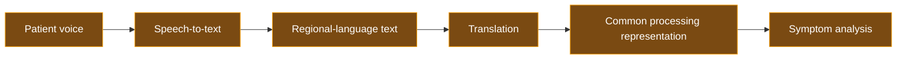
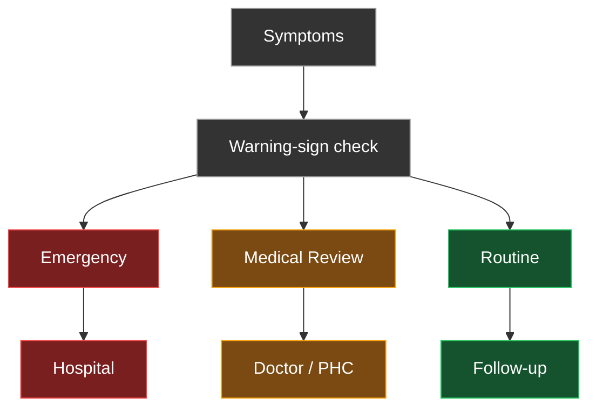
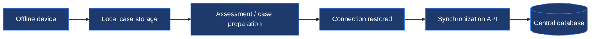

# CareConnect Backend

This directory is planned to contain the backend services for **CareConnect**, a proposed voice-first and offline-first rural healthcare platform.

The backend will handle voice processing, language processing, symptom analysis, triage, referrals, appointments, and synchronization.

---

## Backend Goal


---

## Planned Responsibilities

The backend is expected to provide services for:

- User authentication
- Patient management
- Voice processing and speech-to-text
- Language detection and translation
- Symptom extraction and analysis
- Triage and emergency escalation
- Doctor / PHC referrals
- Appointment management
- Consultation management
- Offline synchronization

---

## Voice Processing

Patients will be able to speak naturally in a supported regional language. The intended processing pipeline is:



The architecture is designed to support multiple regional languages over time, with language processing kept separate from the core triage logic.

---

## Symptom Analysis

The backend will extract relevant information from a patient's description, including:

- Symptoms
- Duration
- Severity
- Associated symptoms
- Potential warning signs

This structured information is then passed to the triage component. Symptom analysis supports triage — it does not produce a diagnosis.

---

## Triage Engine

The triage engine determines urgency, not disease. It classifies each case into one of three categories:

| Category | Meaning | Suggested path |
|---|---|---|
| Emergency | Potential warning signs identified | Immediate healthcare facility |
| Medical Review | Professional assessment recommended | Doctor / PHC consultation |
| Routine | No urgent warning signs identified | Follow-up / routine care |



---

## Connectivity-Aware Consultation

The system adapts the consultation method to available network conditions:

| Connectivity | Consultation mode |
|---|---|
| Good | Video consultation |
| Limited | Audio consultation |
| None | Offline storage, synchronized later |

---

## Offline-First Design

Essential patient information and assessments remain available during connectivity interruptions.



---

## Planned Backend Structure

```
backend/
├── README.md
├── requirements.txt
└── app/
    ├── main.py
    ├── routes/
    │   ├── auth.py
    │   ├── patients.py
    │   ├── voice.py
    │   ├── symptoms.py
    │   ├── triage.py
    │   ├── referrals.py
    │   ├── appointments.py
    │   └── consultation.py
    ├── models/
    ├── schemas/
    └── services/
        ├── speech_service.py
        ├── translation_service.py
        ├── symptom_service.py
        ├── triage_service.py
        └── sync_service.py
```

---

## Proposed API Structure

| Method | Endpoint | Description |
|---|---|---|
| POST | `/api/auth/login` | Authenticate a patient or ASHA worker |
| POST | `/api/patients` | Create or update a patient record |
| POST | `/api/voice/transcribe` | Convert recorded voice to regional-language text |
| POST | `/api/voice/translate` | Translate regional-language text to a common processing language |
| POST | `/api/symptoms/analyze` | Extract structured symptom information |
| POST | `/api/triage` | Classify a case as Emergency, Medical Review, or Routine |
| POST | `/api/referrals` | Create a referral to a facility, doctor, or PHC |
| POST | `/api/appointments` | Schedule or update an appointment |
| POST | `/api/consultations` | Manage a video or audio consultation session |
| POST | `/api/sync` | Synchronize offline-captured cases with the central database |

This is the planned API architecture and is not currently implemented.

---

## Proposed Technology

**Backend framework**
Python, FastAPI, Pydantic, SQLAlchemy

**Voice and language processing**
- Whisper — multilingual speech-to-text
- IndicTrans2 — Indian regional-language translation

**Symptom analysis**
NLP / LLM-assisted extraction and rule-based symptom structuring

**Triage**
Rule-based triage engine using predefined warning signs and urgency rules

**Database**
SQLite for initial development; PostgreSQL for future deployment

**Teleconsultation**
WebRTC or an equivalent real-time communication technology

**Offline synchronization**
Local storage with a synchronization API

---

## Current Status

The backend is currently planned and documented as part of the CareConnect concept. This repository serves as the initial technical documentation and architecture for future implementation.

---

## Medical Safety

The proposed backend is intended to provide preliminary triage and decision support. It should not be presented as an autonomous diagnostic system. Final medical decisions should remain with qualified healthcare professionals.
