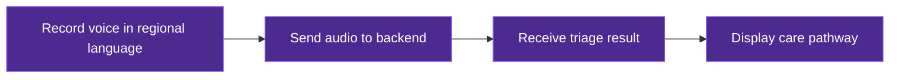
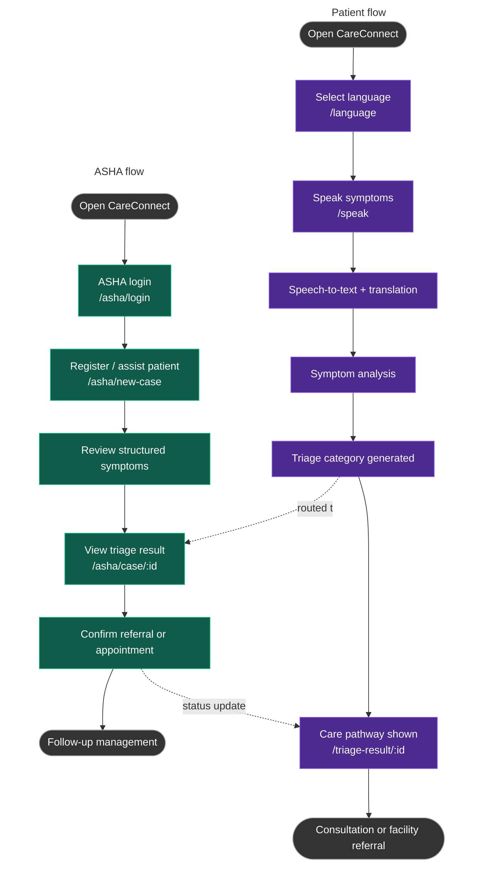
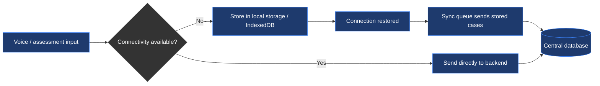

# CareConnect Frontend

This directory is planned to contain the frontend application for **CareConnect**, a proposed voice-first and offline-first rural healthcare platform.

The frontend will handle voice capture, language selection, the patient interface, the ASHA worker dashboard, and offline interaction with the backend.

---

## Frontend Goal



---

## Planned Responsibilities

The frontend is expected to provide:

- Voice recording and playback
- Language selection
- The patient interface
- The ASHA worker dashboard
- Display of symptom information
- Display of triage results
- The referral and appointment interface
- The consultation interface
- Offline interaction and local data storage

---

## Patient and ASHA Worker Journey



---

## Pages

Proposed routes for the CareConnect frontend:

| Route | Page | Access |
|---|---|---|
| `/` | Landing page | Public |
| `/language` | Language selection | Public |
| `/login` | Login | Public |
| `/register` | Register | Public |
| `/speak` | Speak symptoms (voice submission) | Patient |
| `/triage-result/:id` | Triage result and care pathway | Patient |
| `/my-records` | Patient case history | Patient |
| `/asha/login` | ASHA worker login | ASHA Worker |
| `/asha/new-case` | Register / assist a patient | ASHA Worker |
| `/asha/case/:id` | Case detail and triage review | ASHA Worker |
| `/consultation/:id` | Video / audio consultation | Patient · ASHA · Doctor |

These routes reflect the current proposal and may change once implementation begins.

---

## Offline Handling



Teleconsultation itself requires connectivity, but voice capture and case data entry are designed to continue offline.

---

## Planned Frontend Structure

```
frontend/
├── README.md
├── package.json
└── src/
    ├── main.jsx
    ├── App.jsx
    ├── pages/
    │   ├── Landing.jsx
    │   ├── Login.jsx
    │   ├── Register.jsx
    │   ├── LanguageSelect.jsx
    │   ├── Speak.jsx
    │   ├── TriageResult.jsx
    │   ├── MyRecords.jsx
    │   ├── asha/
    │   │   ├── AshaLogin.jsx
    │   │   ├── AshaNewCase.jsx
    │   │   └── AshaCaseDetail.jsx
    │   └── Consultation.jsx
    ├── components/
    │   ├── VoiceRecorder.jsx
    │   ├── LanguagePicker.jsx
    │   ├── TriageBadge.jsx
    │   └── OfflineBanner.jsx
    ├── services/
    │   ├── api.js
    │   ├── voiceService.js
    │   ├── syncService.js
    │   └── storageService.js
    └── context/
        ├── AuthContext.jsx
        └── OfflineContext.jsx
```

---

## Proposed Component Responsibilities

| Component | Purpose |
|---|---|
| `VoiceRecorder` | Captures audio using the MediaRecorder API and sends it for processing |
| `LanguagePicker` | Lets the patient select or confirm a regional language |
| `TriageBadge` | Displays the Emergency / Medical Review / Routine result |
| `OfflineBanner` | Indicates offline status and pending sync items |
| `AuthContext` | Manages patient and ASHA worker session state |
| `OfflineContext` | Tracks connectivity and coordinates the local sync queue |

---

## Proposed Technology

**Core framework**
React, JavaScript, React Router, Axios

**Styling**
Tailwind CSS

**Voice capture**
MediaRecorder API

**Offline storage**
Local storage / IndexedDB

**Responsibilities covered by the frontend**
- Voice recording
- Language selection
- Patient interface
- ASHA worker dashboard
- Displaying symptom and triage information
- Referral and appointment interface
- Consultation interface
- Offline interaction

---

## Current Status

The frontend is currently planned and documented as part of the CareConnect concept. This repository serves as the initial technical documentation and architecture for future implementation.

---

## Medical Safety

The frontend is intended only to capture patient input and display triage results returned by the backend. It does not perform diagnosis or make medical decisions — those remain the responsibility of the triage engine and qualified healthcare professionals.
